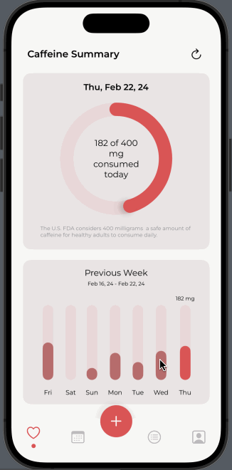

<a name="readme-top"></a>

<!-- PROJECT LOGO -->
<br />
<div align="center">

  <a>
    
  </a>

<h1 align="center">Caffeine Tracker</h1>

  <p align="center" style="font-style: italic;">
    An iOS mobile app that tracks your daily caffeine intake
  </p>
  
</div>


<!-- ABOUT THE PROJECT -->
## About The Project

Caffeine Tracker allows users to record caffeinated drinks they consume in order to track total daily intake and help prevent over-consumption. Its key features include daily record entry, drink history display, and daily & weekly consumption data summary.


#### Built With

[![Swift][Swift]][Swift-url] [![Firebase][Firebase]][Firebase-url] [![XCode][XCode]][XCode-url] 


## Usage


#### User Registration and Authentication

welcome

register

login

register error msg

profile change


#### Drink Record Entry

Default drink list


Entry form


#### Summary Stat Display

summary dashboard



calendar view

drink history


<p align="right">(<a href="#readme-top">back to top</a>)</p>


<!-- ROADMAP -->
## Roadmap

While the Caffeine Tracker app is currently fully functional, a few key future enhancements could make the app more dynamic, thoughtful and fun - 

##### Enhanced default drink list data
* Enhanced default drink list data
* Caffeine metabolism predictive analytics
* Social aspect of the app

<p align="right">(<a href="#readme-top">back to top</a>)</p>


<!-- GETTING STARTED -->
## Getting Started

This app is a personal project built for learning purposes (and for fun!). It is not published on App Store. It also has some potential further enhancements underway. However, if you'd like to play with it on the XCode simulator locally, here is how you might be able to do that!


1. Clone the repo
   ```sh
   git clone https://github.com/lling0212/CaffeineTracker.git
   ```

2. Follow the Firebase iOS setup guide to set up your own backend database - [https://firebase.google.com/docs/ios/setup](https://firebase.google.com/docs/ios/setup)

3. Enable Firebase Authentication, Storage and Firestore Database to allow for the full back-end functionality of the app

<p align="right">(<a href="#readme-top">back to top</a>)</p>


<!-- ACKNOWLEDGMENTS -->
## Acknowledgments

I built this app from scratch with no prior experience with iOS development. Thankfully I was able to rely on some amazing resources to build out both the front end UI and backend functionalities I envisioned. Here is a list of resources that helped tremendously on my development journey: 

* To learn about Firebase and how to set up the basic structure of my app, I took inspiration from [this tutorial](https://youtu.be/t_mypMqSXNw?si=b7Y9zPLR9Mm91Sq1)
* To build the progress ring on the summary dashboard, I referenced [this Medium article](https://medium.com/@frankjia/creating-activity-rings-in-swiftui-11ef7d336676#:~:text=To%20support%20percentages%20over%20100,over%20the%20last%20360%20degrees.)
* To create many of the visual elements (e.g., menu bar), I learned from videos on [this Youtube channel]("https://www.youtube.com/@Kavsoft")
* To build the customized calendar, I referenced [this video](https://youtu.be/pOSQr7DI310?si=DLFOEwOJdXCVhNGN)
* To set up the correct navigation between views, I learned from [this Medium article](https://moussahellal.medium.com/navigation-in-swiftui-custom-and-complete-with-navigationstack-a12f8e8f8745)


<p align="right">(<a href="#readme-top">back to top</a>)</p>


<!-- MARKDOWN LINKS & IMAGES -->
[Swift]: https://img.shields.io/badge/Swift-FA7343?style=for-the-badge&logo=swift&logoColor=white
[Swift-url]: https://www.swift.org/
[XCode]: https://img.shields.io/badge/Xcode-007ACC?style=for-the-badge&logo=Xcode&logoColor=white
[XCode-url]: https://developer.apple.com/xcode/
[Firebase-url]: https://firebase.google.com/
[Firebase]: https://img.shields.io/badge/firebase-ffca28?style=for-the-badge&logo=firebase&logoColor=black
[Progress-bar-url]: https://medium.com/@frankjia/creating-activity-rings-in-swiftui-11ef7d336676#:~:text=To%20support%20percentages%20over%20100,over%20the%20last%20360%20degrees.
[Kavsoft-url]: https://www.youtube.com/@Kavsoft
[iOSAcademy-url]: https://youtu.be/t_mypMqSXNw?si=b7Y9zPLR9Mm91Sq1
[Calendar-url]: https://youtu.be/pOSQr7DI310?si=DLFOEwOJdXCVhNGN
[Navigation-url]: https://moussahellal.medium.com/navigation-in-swiftui-custom-and-complete-with-navigationstack-a12f8e8f8745