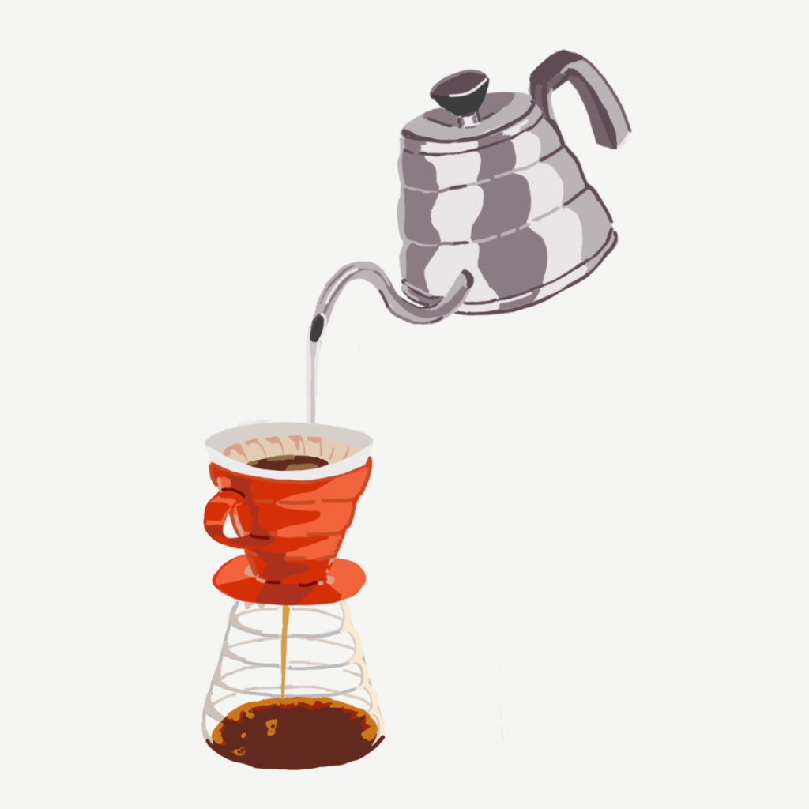
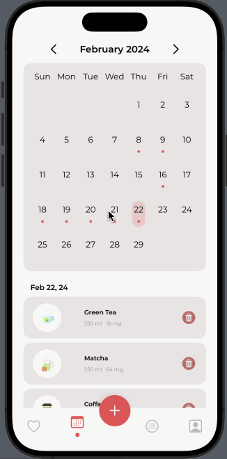
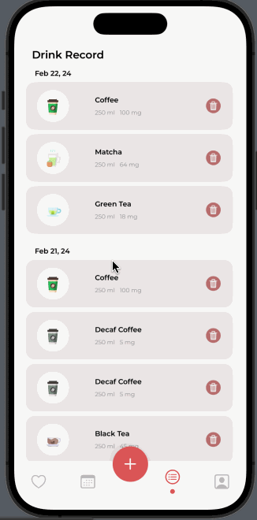
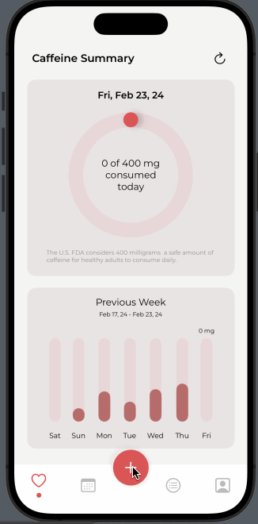
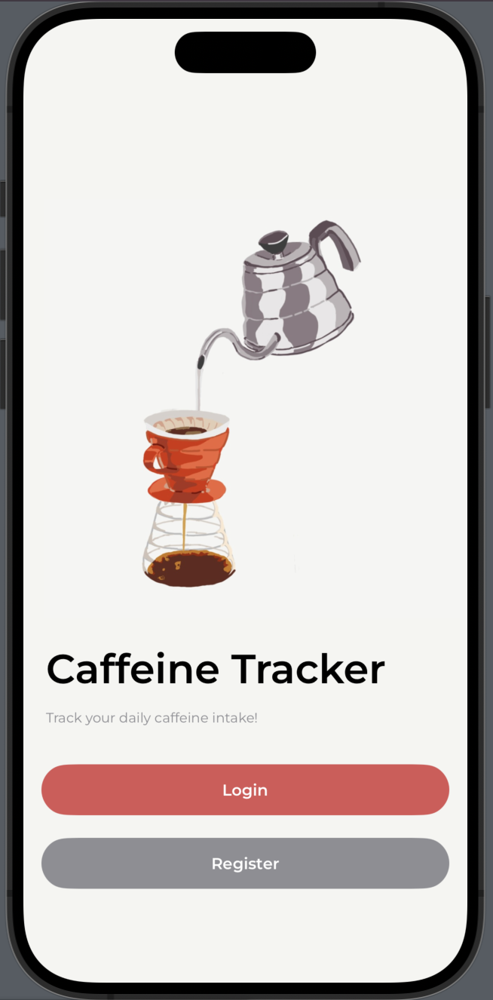
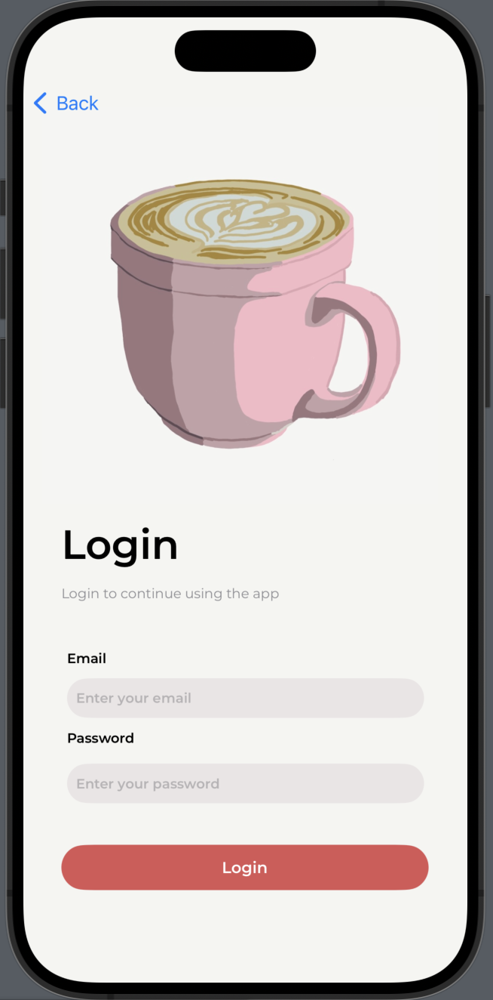
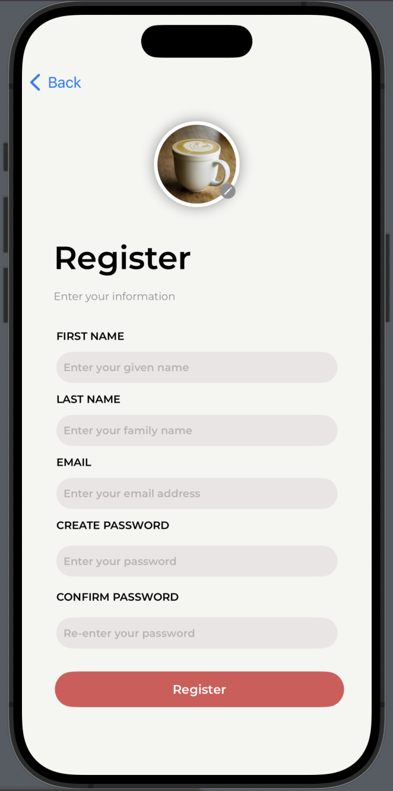
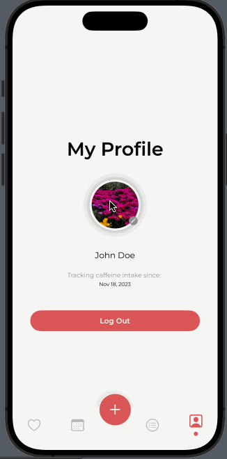

<a name="readme-top"></a>

<!-- PROJECT LOGO -->
<br />
<div align="center">

  <a>
    
  </a>

<h1 align="center">Caffeine Tracker</h1>

  <p align="center" style="font-style: italic;">
    An iOS mobile app that tracks your daily caffeine intake
  </p>
  
</div>


<!-- ABOUT THE PROJECT -->
## About The Project

Caffeine Tracker allows users to record caffeinated drinks they consume in order to track total daily intake and help prevent over-consumption. Its key features include daily record entry, drink history display, and daily & weekly consumption data summary.


#### Built With

[![Swift][Swift]][Swift-url] [![Firebase][Firebase]][Firebase-url] [![XCode][XCode]][XCode-url] 


## Usage


#### Record Data Display

<em>Summary Dashboard</em>
<div align="center" style="text-align:center;">
  
  <div style="margin-top: 20px;"></div>
  <figcaption style="text-align:center"><em>Daily & weekly consumption summarized on main dashboard using a progress ring and an interactive bar chart</em></figcaption>
</div>

<div style="margin-top: 20px;"></div>
<br>

<em>Calendar View</em>
<div align="center" style="text-align:center;">
  
  <div style="margin-top: 20px;"></div>
  <figcaption style="text-align:center"><em>Custom-built calendar to show past consumption by month; daily record display for user selected date</em></figcaption>
</div>

<div style="margin-top: 20px;"></div>
<br>

<em>Drink Record List</em>
<div align="center" style="text-align:center;">
  
  <div style="margin-top: 20px;"></div>
  <figcaption style="text-align:center"><em>All past entries grouped by date; option for user to delete selected entries</em></figcaption>
</div>

<div style="margin-top: 20px;"></div>
<br>

#### Drink Record Entry

<div align="center" style="text-align:center;">
  
  <div style="margin-top: 20px;"></div>
  <figcaption style="text-align:center"><em>Users can record new drinks by picking from the default list or customizing a drink entry; all drink data stored on Firestore</em></figcaption>
</div>

<div style="margin-top: 40px;"></div>
<br>


#### User Management

<em>Registration & Authentication</em>
<div align="center">
<div align="center" style="display:flex; justify-content:center;">
    
    
    
</div>
<div style="margin-top: 20px;"></div>
<figcaption style="text-align:center"><em>User managed through Firebase Authentication</em></figcaption>
</div>

<div style="margin-top: 20px;"></div>
<br>

<em>Profile Change</em>
<div align="center" style="text-align:center;">
  
  <div style="margin-top: 20px;"></div>
  <figcaption style="text-align:center"><em>Profile picture change enabled by Photos Picker; image uploaded to Firebase Storage</em></figcaption>
</div>

<div style="margin-top: 40px;"></div>
<br>

<p align="right">(<a href="#readme-top">back to top</a>)</p>

<!-- ROADMAP -->
## Roadmap

While the Caffeine Tracker app is currently fully functional, a few key future enhancements could make the app more dynamic, thoughtful and fun - 

* **Enhanced default drink list data**: as of now, the default drink data is static and limited to a few types of drinks. Options are being explored to either connect to existing database or to build one by web-scraping drink data to reduce user's manual data entry and to increase accruacy in tracked data
* **Caffeine metabolism prediction**: depending on when a drink is consumed during a day, the caffeine remaining in one's system decreases. A cool feature to add is a prediction chart on the main dashboard showing how the caffeine amount decreases throughout the remaining day
* **Social aspect of the app**: Instagram-like feature to let users upload photos and jog down short notes on their drinks, and share with fellow users of the app 

<p align="right">(<a href="#readme-top">back to top</a>)</p>


<!-- GETTING STARTED -->
## Getting Started

This app is a personal project built for learning purposes (and for fun!). It is not published on App Store. It also has some potential further enhancements underway. However, if you'd like to play with it on XCode locally, here is how you might be able to do that!


1. Clone the repo
   ```sh
   git clone https://github.com/lling0212/CaffeineTracker.git
   ```

2. Follow the Firebase iOS setup guide to set up your own backend database - [https://firebase.google.com/docs/ios/setup](https://firebase.google.com/docs/ios/setup)

3. Enable Firebase Authentication, Storage and Firestore Database to allow for the full back-end functionality of the app

<p align="right">(<a href="#readme-top">back to top</a>)</p>


<!-- ACKNOWLEDGMENTS -->
## Acknowledgments

I built this app from scratch with no prior experience with iOS development. Thankfully I was able to rely on some amazing resources to build out both the front end UI and backend functionalities I envisioned. Here is a list of resources that helped tremendously on my development journey: 

* To learn about Firebase and how to set up the basic structure of my app, I took inspiration from [this tutorial](https://youtu.be/t_mypMqSXNw?si=b7Y9zPLR9Mm91Sq1)
* To build the progress ring on the summary dashboard, I referenced [this Medium article](https://medium.com/@frankjia/creating-activity-rings-in-swiftui-11ef7d336676#:~:text=To%20support%20percentages%20over%20100,over%20the%20last%20360%20degrees.)
* To create many of the visual elements (e.g., menu bar), I learned from videos on [this Youtube channel](https://www.youtube.com/@Kavsoft)
* To build the customized calendar, I referenced [this video](https://youtu.be/pOSQr7DI310?si=DLFOEwOJdXCVhNGN)
* To set up the correct navigation between views, I learned from [this Medium article](https://moussahellal.medium.com/navigation-in-swiftui-custom-and-complete-with-navigationstack-a12f8e8f8745)


<p align="right">(<a href="#readme-top">back to top</a>)</p>


<!-- MARKDOWN LINKS & IMAGES -->
[Swift]: https://img.shields.io/badge/Swift-FA7343?style=for-the-badge&logo=swift&logoColor=white
[Swift-url]: https://www.swift.org/
[XCode]: https://img.shields.io/badge/Xcode-007ACC?style=for-the-badge&logo=Xcode&logoColor=white
[XCode-url]: https://developer.apple.com/xcode/
[Firebase-url]: https://firebase.google.com/
[Firebase]: https://img.shields.io/badge/firebase-ffca28?style=for-the-badge&logo=firebase&logoColor=black
[Progress-bar-url]: https://medium.com/@frankjia/creating-activity-rings-in-swiftui-11ef7d336676#:~:text=To%20support%20percentages%20over%20100,over%20the%20last%20360%20degrees.
[Kavsoft-url]: https://www.youtube.com/@Kavsoft
[iOSAcademy-url]: https://youtu.be/t_mypMqSXNw?si=b7Y9zPLR9Mm91Sq1
[Calendar-url]: https://youtu.be/pOSQr7DI310?si=DLFOEwOJdXCVhNGN
[Navigation-url]: https://moussahellal.medium.com/navigation-in-swiftui-custom-and-complete-with-navigationstack-a12f8e8f8745
